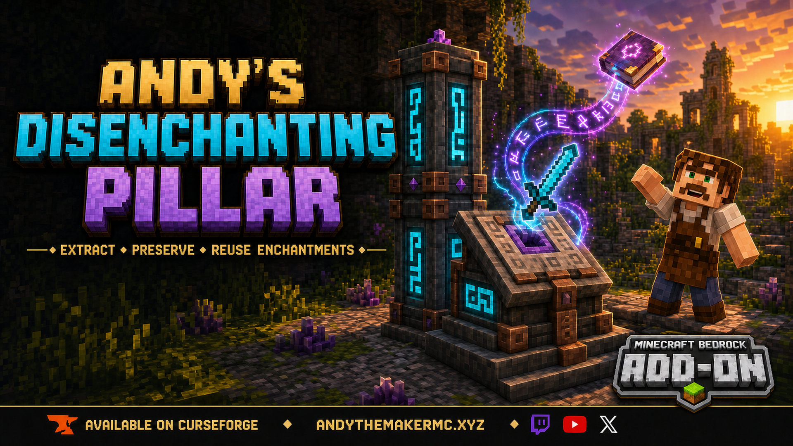

# Andy's Disenchanting Pillar



Andy’s Disenchanting Pillar is a survival-focused Minecraft Bedrock add-on that removes one selected enchantment from an item and preserves it on a new enchanted book.

It behaves like a reverse enchanting workstation: load an enchanted item, blank books, and amethyst shards; select the enchantment you want; review the XP cost; then take the output book to commit the transfer.

The costs are intentionally substantial. Moving a valuable enchantment without destroying the source item is powerful, so the add-on requires mid-game materials and recurring resources to keep the feature useful without making vanilla enchanting, exploration, loot, or anvil progression irrelevant in Survival.

Current version: **1.6.8**

[Download Andy's Disenchanting Pillar v1.6.8](<dist/Andys Disenchanting Pillar v1.6.8.mcaddon>)

## Features

- Removes one chosen enchantment at a time.
- Works with enchanted tools, weapons, armor, and multi-enchantment books.
- Preserves enchantments that were not selected.
- Uses a real container-style interface with drag and shift-click support.
- Shows a safe preview before anything is consumed.
- Costs one blank book, configurable XP levels, and configurable amethyst shards.
- Defaults to eight amethyst shards per extraction.
- Adds configurable surcharges for Mending and curses.
- Clears hidden vanilla prior-work history so extracted enchantments remain practical to reapply.
- Includes an automatically delivered signed CWES guide and a recipe for replacement copies.
- Provides 48 craft-selected vanilla body materials.
- Provides compact pillars, two-block stacked pillars, and one-block altars.
- Supports all 16 normal dyes for rune recoloring.
- Uses rune-only emissive rendering, varied dye-matched floating glyphs, and a brief faint periodic surface glint.
- Supports Vibrant Visuals without a constant full-body glint or additive particle bloom.
- Uses stable Script APIs and requires no experimental gameplay toggles.

## Three workstation forms

All three forms disenchant items in exactly the same way. They use the same inventory, interface, costs, storage rules, dye system, visual effects, admin settings, and transaction logic. The choice between them is aesthetic: use the shape that best fits the build.

### Compact Disenchanting Pillar

Place one crafted pillar to create the one-block workstation. The model has a stepped body, copper fittings, recessed glowing rune panels, and a vanilla-textured amethyst cluster at its crown.

### Tall Disenchanting Pillar

Hold a second pillar of the same material and interact with the compact pillar. The held pillar is consumed outside Creative mode, the two blocks become a coordinated two-block model, and they continue using the lower block’s storage.

Two blocks is the maximum. A third matching pillar is rejected and returned outside Creative mode.

Breaking the upper half leaves the lower half as a working compact pillar. Breaking the lower half leaves the upper half as a compact pillar and moves the stored contents upward with it.

### Disenchanting Altar

The altar is a one-block alternate housing for the same Mystic technology. It has a broad stepped plinth, copper braces, four rune panels, and a directional lectern-style top with a vanilla-textured amethyst cluster projecting from its central opening.

The altar has no decorative book. Blank books remain a gameplay input inside the interface.

Unlike pillars, altars do not stack. This is only a visual difference; an altar has the same disenchanting capabilities as either pillar form.

## Requirements

- Minecraft Bedrock with a minimum engine version of **1.26.30**.
- Both included packs must be active at version 1.6.8.
- Stable `@minecraft/server` 2.8.0 and `@minecraft/server-ui` 2.1.0 support.
- For each extraction:
  - one enchanted source item;
  - one ordinary book;
  - the configured amethyst-shard cost;
  - enough XP levels.

## Installation

1. Download `Andys Disenchanting Pillar v1.6.8.mcaddon`.
2. Open the file with Minecraft Bedrock.
3. Wait for Bedrock to finish importing or updating both included packs.
4. Create a world or edit an existing world.
5. Open **Behavior Packs**, select **My Packs**, and activate **Andy’s Disenchanting Pillar [BP]**.
6. Open **Resource Packs** and confirm that **Andy’s Disenchanting Pillar [RP]** is active. Bedrock may activate the paired resource pack automatically.
7. Start the world. No experimental gameplay toggles are required.

When updating:

1. Back up the world.
2. Import the newer `.mcaddon`.
3. Confirm that the behavior and resource packs are both the same new version.
4. Completely leave and reopen the world before testing existing workstations.
5. If multiple installed versions are shown, activate only the newest matching behavior and resource packs.

Back up an important world before installing a new add-on version.

## Crafting the workstations

### Compact pillar recipe

Each material variant uses the same shaped crafting-table pattern:

```text
Amethyst Shard | Lapis Block      | Amethyst Shard
Copper Ingot   | Enchanting Table | Copper Ingot
Body Material  | Obsidian         | Body Material
```

The two body-material positions determine the permanent appearance of the crafted pillar. Material cannot be changed after crafting.

### Tall pillar assembly

A tall pillar uses **two compact pillars of the same material**:

1. Craft two matching Disenchanting Pillars.
2. Place the first pillar.
3. Hold the second matching pillar.
4. Interact with the placed pillar.

The held pillar is consumed outside Creative mode and the model becomes a coordinated two-block workstation. Do not try to place a normal block directly on top; tall-pillar assembly is performed by interacting with the placed pillar while holding its matching pillar item.

### Altar recipe

Use a shapeless crafting recipe:

```text
1 matching Disenchanting Pillar
2 Copper Ingots
1 Amethyst Shard
= 1 matching Disenchanting Altar
```

The altar retains the pillar’s selected body material.

### Resource totals by form

| Finished form | Total resources |
|---|---|
| Compact pillar | 2 Amethyst Shards, 1 Lapis Block, 2 Copper Ingots, 1 Enchanting Table, 1 Obsidian, 2 matching Body Material blocks |
| Tall pillar | 4 Amethyst Shards, 2 Lapis Blocks, 4 Copper Ingots, 2 Enchanting Tables, 2 Obsidian, 4 matching Body Material blocks |
| Altar | 3 Amethyst Shards, 1 Lapis Block, 4 Copper Ingots, 1 Enchanting Table, 1 Obsidian, 2 matching Body Material blocks |

All three are full workstations. The tall pillar does not process enchantments faster or more cheaply, and the altar does not have different recipes or output rules after placement. Choose by appearance and available build space.

### Supported body materials

| Family | Materials |
|---|---|
| Stone | Stone, Smooth Stone, Cobblestone, Mossy Cobblestone, Stone Bricks, Mossy Stone Bricks, Cracked Stone Bricks, Chiseled Stone Bricks |
| Andesite | Andesite, Polished Andesite |
| Diorite | Diorite, Polished Diorite |
| Granite | Granite, Polished Granite |
| Tuff | Tuff, Polished Tuff, Tuff Bricks, Chiseled Tuff |
| Deepslate | Deepslate, Cobbled Deepslate, Polished Deepslate, Deepslate Bricks, Cracked Deepslate Bricks, Deepslate Tiles, Cracked Deepslate Tiles, Chiseled Deepslate |
| Earthen | Mud Bricks, Packed Mud |
| Mineral | Calcite, Dripstone Block |
| Quartz | Quartz Block, Smooth Quartz, Quartz Bricks, Chiseled Quartz |
| Sandstone | Sandstone, Smooth Sandstone, Chiseled Sandstone, Cut Sandstone |
| Nether | Netherrack, Nether Bricks, Red Nether Bricks, Blackstone, Polished Blackstone, Polished Blackstone Bricks, Basalt, Polished Basalt |
| Ocean | Prismarine, Dark Prismarine |

The models reference Minecraft’s built-in textures for these body materials, copper fittings, dark recesses, and amethyst details. No copied vanilla texture images are stored in the add-on.

## Using a workstation

### Interface slots

| Slot or area | What belongs there |
|---|---|
| **Item** | One enchanted tool, weapon, armor piece, or enchanted book |
| **Books** | Ordinary books; accepts a stack of up to 64 |
| **Amethyst Shards** | Amethyst shards used to pay the configured extraction cost |
| **Enchantments** | One selectable row for each enchantment on the source item |
| **Output** | A preview of the enchanted book that will be created |

### Disenchanting step by step

1. Interact with the pillar or altar body.
2. Place one enchanted item in **Item**.
3. Place ordinary books in **Books**. The slot accepts up to 64.
4. Place amethyst shards in **Amethyst Shards**.
5. Select the named enchantment row you want to remove.
6. Review the XP, shard, and book costs.
7. The prospective enchanted book appears in **Output**.
8. Select another row if you want to change the preview. This is free.
9. Take or shift-click the output book to complete the disenchantment.

Selecting an enchantment consumes nothing. The transaction commits only when the previewed output is taken.

If the source is an enchanted book, its final removed enchantment converts the empty source into an ordinary book.

One extraction removes only the selected enchantment. Repeat the process with another book, eight more shards by default, and the newly displayed XP cost to remove another enchantment.

The compact pillar, tall pillar, and altar all follow these same steps.

## Default costs

The normal XP portion is based on enchantment rarity and enchantment level. It is limited to one through four XP levels by default. These are player **levels**, not raw XP points.

| Setting | Default |
|---|---:|
| Common base | 1 level |
| Uncommon base | 2 levels |
| Rare base | 3 levels |
| Very rare base | 4 levels |
| Each enchantment level above I | +1 level |
| Normal minimum | 1 level |
| Normal maximum | 4 levels |
| Mending surcharge | +5 levels |
| Curse surcharge | +30 levels |
| Amethyst shards | 8 shards |
| Ordinary books | 1 book |

Mending and curse surcharges are added after the normal one-to-four-level bound. Curse of Binding and Curse of Vanishing can be removed, but doing so is intentionally expensive.

Unknown or add-on enchantments default to Rare unless added to the rarity table.

### Normal XP cost by rarity and enchantment level

| Rarity | Level I | Level II | Level III | Level IV | Level V or higher |
|---|---:|---:|---:|---:|---:|
| Common | 1 | 2 | 3 | 4 | 4 |
| Uncommon | 2 | 3 | 4 | 4 | 4 |
| Rare | 3 | 4 | 4 | 4 | 4 |
| Very rare | 4 | 4 | 4 | 4 | 4 |

Every successful extraction also consumes one ordinary book and eight amethyst shards at the default settings.

### Example default costs

| Enchantment | Calculation | Final XP cost | Other resources |
|---|---|---:|---|
| Efficiency I | Common I | 1 level | 1 book + 8 shards |
| Efficiency V | Common V, capped at 4 | 4 levels | 1 book + 8 shards |
| Unbreaking II | Uncommon II | 3 levels | 1 book + 8 shards |
| Fortune III | Rare III, capped at 4 | 4 levels | 1 book + 8 shards |
| Silk Touch I | Very rare I | 4 levels | 1 book + 8 shards |
| Mending I | Very rare I + 5-level surcharge | 9 levels | 1 book + 8 shards |
| Curse of Binding I | Very rare I + 30-level surcharge | 34 levels | 1 book + 8 shards |
| Curse of Vanishing I | Very rare I + 30-level surcharge | 34 levels | 1 book + 8 shards |

### Why extraction is expensive

The balance is deliberate. The workstation preserves both the source item and the extracted enchantment, which can bypass much of the risk and randomness of normal enchanting. Requiring an enchanting table in the workstation recipe, plus a book, amethyst shards, and XP for every transfer, makes the add-on a powerful mid-game tool rather than a game-breaking unlimited enchantment splitter. Operators who want a different balance can adjust every XP category, special surcharge, and shard cost.

## Behavior-pack gear settings

Before entering a world, select the gear icon beside the Andy's Disenchanting Pillar behavior pack to configure:

- the base XP level cost for Common, Uncommon, Rare, and Very Rare enchantments;
- the additional cost for each enchantment level above I;
- the minimum and maximum normal XP costs;
- the Mending surcharge;
- the curse surcharge;
- the number of Amethyst Shards consumed per extraction.

These values become the world defaults. The in-game operator menu can temporarily override them. Changing a value through the behavior-pack gear menu applies the new gear configuration and replaces any older in-game override.

## Dyeing the runes

Hold any standard dye and interact with a pillar or altar. One dye is consumed outside Creative mode.

The physical body material never changes. Only the rune channels and floating glyphs change color.

Supported colors:

`white`, `orange`, `magenta`, `light blue`, `yellow`, `lime`, `pink`, `gray`, `light gray`, `cyan`, `purple`, `blue`, `brown`, `green`, `red`, and `black`.

Both halves of a tall pillar update together.

Rune color is cosmetic and does not change extraction behavior, cost, light strength, or enchantment compatibility.

## Visual effects

- Rune channels remain emissive in darkness.
- Body surfaces do not glow.
- Copper and amethyst use Minecraft’s own visual materials.
- Sparse enchanting glyphs float around all three workstation forms when a player is nearby.
- Particle color follows the current rune dye.
- Completed extraction creates a stronger burst.
- Amethyst consumption plays the amethyst break sound.
- Powered feedback temporarily increases light emission.
- A sparse, non-emissive surface glint sweeps across the main faces approximately every 7.6 seconds.

The resource pack declares Bedrock’s `pbr` capability for Vibrant Visuals. Classic and Fancy modes continue to use the normal color textures.

## Administration

World operators can sneak-interact with any pillar section or altar while not holding a dye, or run:

```text
/scriptevent adp:admin
```

The menu controls:

- base XP level cost for each rarity;
- extra cost per enchantment level;
- minimum and maximum normal XP costs;
- Mending surcharge;
- curse surcharge;
- amethyst shards consumed per extraction;
- reset to the behavior-pack gear settings.

To request another guide:

```text
/scriptevent adp:guide
```

## In-game guide

Each player receives a signed CWES field guide on first load. A replacement copy can be crafted in any crafting grid:

```text
1 Book + 1 Amethyst Shard = CWES Pillar Guide
```

The guide explains all three workstation forms, material selection, stacking, rune dyes, costs, and the extraction process.

## Transaction safety

The add-on validates the source item, selected enchantment, blank book, shard count, XP level, output compatibility, player proximity, and inventory space before committing.

If a commit throws, it attempts to restore the source item, books, shards, XP, and destination slot.

Minecraft Bedrock does not expose the hidden vanilla anvil prior-work value through the stable Script API. The add-on prevents runaway reapplication costs by rebuilding the source item and restoring the data exposed by the API:

- custom name;
- lore;
- durability;
- dye color;
- Adventure restrictions;
- keep-on-death and lock settings;
- dynamic properties;
- remaining enchantments.

Test unusual third-party items in a backed-up world because add-ons may store private data that the stable API cannot copy.

## Updating from 1.4.x

Version 1.6.8 retains the legacy block identifier for migration only.

When a loaded legacy three-block pillar is found:

- its base and middle are converted to the new polished-blackstone-brick two-block pillar;
- its former top is removed;
- rune color and powered state are preserved;
- its storage entity and physical contents remain at the lower block.

Test migration in a copied world before updating an irreplaceable save.

## Troubleshooting

### The recipe does not appear

- Confirm that **Andy’s Disenchanting Pillar [BP]** is active.
- Confirm that its paired resource pack is active at the same version.
- Use a crafting table, not the 2×2 inventory grid.
- Use two identical supported body-material blocks in the bottom corners.
- Completely leave and reopen the world after changing active packs.

### The pillar or altar does not open

- Confirm that both included packs are active at version 1.6.8.
- Interact with any visible part of the workstation. Either level of a tall pillar can be used.
- Completely leave and reopen the world after installing or updating.
- Test once with other UI-changing resource packs disabled.

### No enchantments or output appear

- Put one enchanted vanilla item or enchanted book in **Item**.
- Put ordinary books in **Books**.
- Put enough shards in **Amethyst Shards**.
- Select a named enchantment row.
- Remove and reinsert the source if its enchantments changed after the interface opened.

### The output cannot be taken

- Confirm that the player has the displayed number of XP levels.
- Confirm that the book and shard costs are still present.
- Make room in the player inventory when using shift-click.
- Reselect the enchantment if the source item or workstation contents changed.

### Dyeing or administration does not work

- Hold one normal dye and interact directly with the workstation to recolor its runes.
- Operators must sneak-interact while not holding dye to open settings.
- Operators can also run `/scriptevent adp:admin`.

### Import or version problems

- Confirm that the installer ends in `.mcaddon`, not `.zip`.
- Do not extract, rename, or recompress it.
- Download it again if the file may be incomplete.
- Remove obsolete copies under **Settings → Storage** if necessary.
- Restart Minecraft, import again, and activate the matching BP and RP.

## Support

[AndyTheMakerMC.xyz](https://AndyTheMakerMC.xyz)

### Reporting problems

Include:

- add-on version;
- Minecraft Bedrock version and platform;
- whether both packs are active at the same version;
- source item, enchantments, selected enchantment, and displayed cost;
- workstation form and body material;
- exact reproduction steps;
- screenshot or video for visual or UI issues;
- relevant content-log messages;
- whether the problem remains in a new test world with other add-ons disabled.

## Status

Version 1.6.5 was the first public release. Version 1.6.8 preserves full-model interaction while temporarily releasing the hidden interface target during mining, adds behavior-pack gear settings, and retains automatic recovery for missing interface storage. The combined installer passes JSON, JavaScript, manifest, settings, dependency, PBR-material, geometry, archive-layout, and release-content validation.

## License and attribution

Copyright © AndyTheMaker 2026. All rights reserved, except for the separately credited CC0 floating-rune source.

You may use the unmodified add-on in personal worlds, multiplayer worlds, Realms, servers, videos, livestreams, reviews, tutorials, and showcases.

Do not redistribute, mirror, sell, repackage, modify and publish, or claim the project as your own without written permission.

The floating-rune visual is derived from a CC0 source and may be reused under the terms of that dedication. All other project code, models, textures, UI, branding, and documentation remain subject to the restrictions above.

Minecraft is a trademark of Microsoft Corporation. This independent add-on is not an official Minecraft product and is not approved by or associated with Mojang or Microsoft.

## More Andy The Maker Add-ons

Explore more official Andy The Maker-created add-ons for Minecraft Bedrock:

- [Andy's Configurable Vein Miner & Tree Capacitor](https://github.com/CharlesJGantt/andys-configurable-vein-miner-and-tree-capacitor) — Crouch-activated configurable vein mining and tree felling.
- [Andy's Copper Powered Rails](https://github.com/CharlesJGantt/andys-copper-powered-rails) — Craft powered rails with copper instead of gold.
- [Andy's Dyeable Item Frames](https://github.com/CharlesJGantt/andys-dyeable-item-frames) — Dye normal and glow item frames with rotation and label controls.
- [Andy's Handy Hotbar Reloader](https://github.com/CharlesJGantt/andys-handy-hotbar-reloader) — Auto-refill, slot memory, and per-player hotbar blueprints.
- [Andy's Palette Paver](https://github.com/CharlesJGantt/andys-palette-paver) — Randomize hotbar block placement for natural-looking builds.
- [Andy's Runebound Reliquary](https://github.com/CharlesJGantt/Andys-Runebound-Reliquary) — Survival-balanced, upgradeable experience storage.
- [Andy's Silk Touch Relics](https://github.com/CharlesJGantt/Andys-Silk-Touch-Relics) — Achievement-friendly rare-block harvesting.
- [Andy's Ticking Area Rune](https://github.com/CharlesJGantt/Andys-Ticking-Area-Rune) — Configurable ticking areas and chunk loading.
